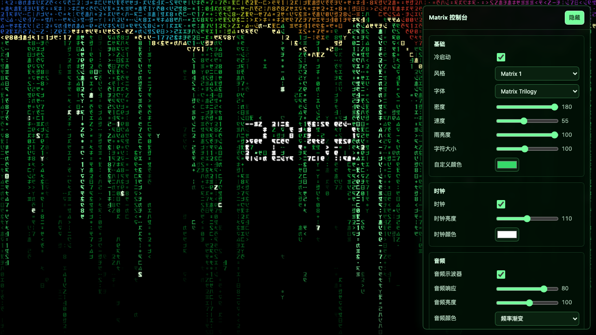

# Matrix Code Rain Wallpaper

A lightweight Wallpaper Engine web wallpaper that recreates a Matrix-style code rain scene with local HTML, CSS, JavaScript, and bundled fonts. It renders in real time on a fixed character grid instead of playing a video, so the project stays small, adjustable, and efficient.

Matrix Code Rain Wallpaper 是一个轻量级的 Wallpaper Engine Web 动态壁纸，用本地 HTML、CSS、JavaScript 和字体实时渲染黑客帝国风格代码雨。它不依赖录屏视频或 `.scr` 屏保文件，体积更小，也更适合长期作为桌面壁纸运行。

Live preview: [ericcilcn.github.io/MatrixCodeRainWallpaper](https://ericcilcn.github.io/MatrixCodeRainWallpaper/)

## Preview Links / 效果预览

These links open the current public web wallpaper. Browser previews cannot receive real Wallpaper Engine audio; real audio response works inside Wallpaper Engine.

下面两个链接打开当前公开网页版本。普通浏览器无法读取 Wallpaper Engine 的真实音频数据；真实音频响应需要在 Wallpaper Engine 里运行。

- [Default / 默认效果](https://ericcilcn.github.io/MatrixCodeRainWallpaper/)
- [Controls / 控制台](https://ericcilcn.github.io/MatrixCodeRainWallpaper/?controls=1&debugstate)

## Support

Matrix Code Rain Wallpaper is free to use. Official support pages for this project and Ericcil's other lightweight tools are listed here:

- [Ko-fi](https://ko-fi.com/ericcil)
- [爱发电 / Afdian](https://ifdian.net/a/Ericcil)

Creator-page and Workshop description drafts are in [docs/support-pages.md](docs/support-pages.md).

## Screenshots

### Default / 默认效果


### Controls / 控制台



## Features / 主要功能

- Real-time Canvas renderer with Matrix-style fixed-grid rain.
- 实时 Canvas 渲染，字符固定在网格内，模拟 Matrix 风格代码雨。
- Local bundled fonts, including Matrix Trilogy and Matrix Resurrections options.
- 内置本地字体，支持 Matrix Trilogy 和 Matrix Resurrections 两种字体选项。
- Wallpaper Engine user properties for cold start, style, font, density, speed, rain brightness, character size, custom color, clock, and audio spectrum.
- Wallpaper Engine 属性面板可调冷启动、风格、字体、密度、速度、雨亮度、字符大小、自定义颜色、时钟和音频示波器。
- Two rain styles: Matrix 1 and Matrix 2&3.
- 两种代码雨风格：Matrix 1 和 Matrix 2&3。
- Optional dot-matrix clock rendered from code-rain glyph cells.
- 可选点阵时钟，使用代码雨字符格组成时间显示。
- Optional audio spectrum layer using Wallpaper Engine audio data.
- 可选音频频谱层，读取 Wallpaper Engine 的音频数据做动态响应。
- Audio modes including frequency gradient, aurora gradient, neon blocks, cool tint, and peak caps only.
- 音频颜色模式包括频率渐变、极光渐变、霓虹色块、冷色微光和仅峰值帽。
- Optional reversed spectrum that grows from the bottom upward.
- 可选反向示波器，让音频柱从屏幕底部向上顶出。
- Cold start where the main rain itself begins from black and falls in from the top.
- 主雨冷启动：真实代码雨从黑屏开始，由顶部落下进入正常随机状态。
- Browser control panel for previewing settings with URL parameters.
- 网页控制台，可通过 URL 参数在浏览器里调试预览。
- No video playback, no `.scr`, no Windows binary dependency.
- 无视频播放、无 `.scr`、无 Windows 二进制依赖。

## Wallpaper Engine Setup

1. Download the release zip.
2. Extract it.
3. In Wallpaper Engine, create or import a web wallpaper from `MatrixCodeRainWallpaper/index.html`.
4. Use the Wallpaper Engine properties panel to adjust the wallpaper.

The audio spectrum requires Wallpaper Engine's desktop audio processing. Normal browsers and GitHub Pages cannot access Wallpaper Engine audio.

## Local Development

From the repository root:

```sh
python3 -m http.server 8765 --directory MatrixCodeRainWallpaper
```

This command serves the same files locally for development. Public preview links are listed in the Preview Links section above.

## Main Settings

- `Cold start`: enabled by default; turn it off to start immediately from the stable rain state.
- `Style`: Matrix 1 or Matrix 2&3.
- `Font`: Matrix Trilogy or Matrix Resurrections.
- `Density`: default `180`, controls overall rain amount.
- `Speed`: controls rain speed.
- `Rain brightness`: controls the green rain brightness.
- `Character size`: changes the grid and glyph size together.
- `Custom color`: changes the base rain color.
- `Clock`: toggles the dot-matrix clock.
- `Clock brightness`: controls only the clock brightness.
- `Clock color`: controls only the clock color.
- `Audio spectrum`: toggles the audio-responsive visualizer.
- `Audio response`: default `80`, controls spectrum amplitude response.
- `Audio brightness`: controls only the audio spectrum brightness.
- `Audio color`: spectrum color/display preset.
- `Reverse spectrum`: makes the audio spectrum grow from the bottom upward.

## Project Layout

```text
MatrixCodeRainWallpaper/
  assets/fonts/
  index.html
  main.js
  project.json
  style.css
  THIRD_PARTY_NOTICES.md
```

Reference videos, screenshots, extracted screensaver files, and other local analysis assets are intentionally excluded from the wallpaper package.

## Credits

This project includes third-party font assets. See [THIRD_PARTY_NOTICES.md](MatrixCodeRainWallpaper/THIRD_PARTY_NOTICES.md).
