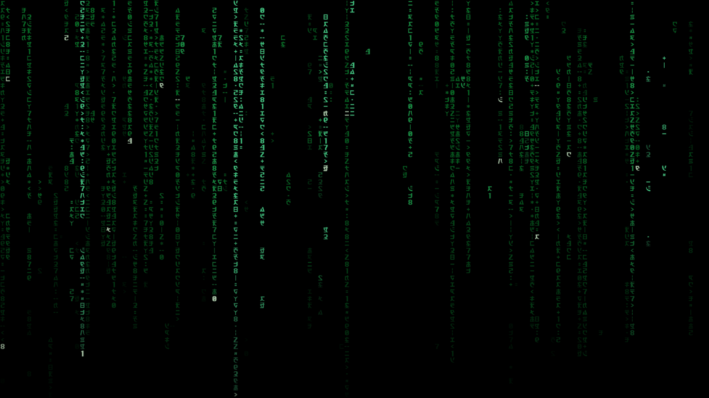
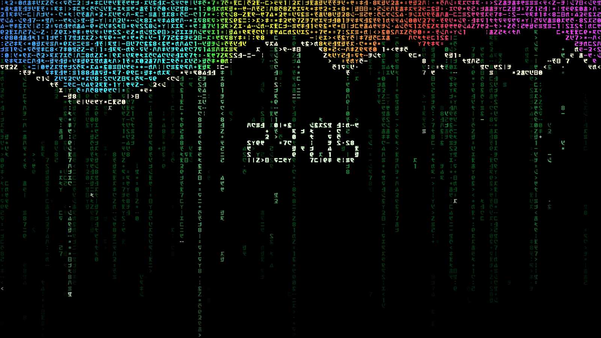
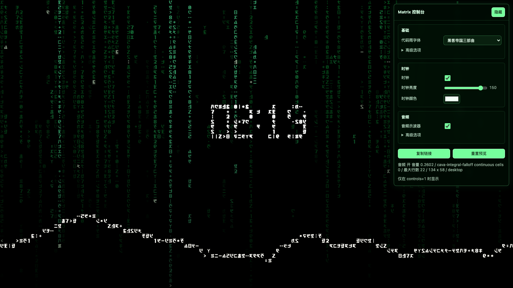

# Matrix Code Rain Wallpaper

A lightweight Wallpaper Engine web wallpaper that recreates a Matrix-style code rain scene with local HTML, CSS, JavaScript, and bundled fonts. It renders in real time on a fixed character grid instead of playing a video, so the project stays small, adjustable, and efficient.

Matrix Code Rain Wallpaper 是一个轻量级的 Wallpaper Engine Web 动态壁纸，用本地 HTML、CSS、JavaScript 和字体实时渲染黑客帝国风格代码雨。它不依赖录屏视频或 `.scr` 屏保文件，体积更小，也更适合长期作为桌面壁纸运行。

Live preview: [ericcilcn.github.io/MatrixCodeRainWallpaper](https://ericcilcn.github.io/MatrixCodeRainWallpaper/)

## Preview Links / 效果预览

These links open the same web wallpaper with different URL parameters. Browser previews cannot receive real Wallpaper Engine audio, so audio examples use the built-in debug signal.

下面这些链接会用不同 URL 参数打开同一个 Web 壁纸。普通浏览器无法读取 Wallpaper Engine 的真实音频数据，所以音频示例使用内置调试信号模拟。

- [Default Matrix rain / 默认代码雨](https://ericcilcn.github.io/MatrixCodeRainWallpaper/MatrixCodeRainWallpaper/index.html)
- [Hidden controls / 隐藏控制台](https://ericcilcn.github.io/MatrixCodeRainWallpaper/MatrixCodeRainWallpaper/index.html?controls=1&debugstate)
- [Main rain cold start / 主雨冷启动](https://ericcilcn.github.io/MatrixCodeRainWallpaper/MatrixCodeRainWallpaper/index.html?skipintro=false&clock=false&audio=false)
- [Clock enabled / 点阵时钟](https://ericcilcn.github.io/MatrixCodeRainWallpaper/MatrixCodeRainWallpaper/index.html?clock=true&audio=false)
- [Audio spectrum debug / 音频频谱模拟](https://ericcilcn.github.io/MatrixCodeRainWallpaper/MatrixCodeRainWallpaper/index.html?controls=1&debugstate&audio=true&audiodebug=1)
- [Frequency gradient spectrum / 频率渐变示波器](https://ericcilcn.github.io/MatrixCodeRainWallpaper/MatrixCodeRainWallpaper/index.html?controls=1&debugstate&audio=true&audiodebug=1&audiocolormode=frequency_gradient)
- [Peak caps only, reversed / 仅峰值帽反向示波器](https://ericcilcn.github.io/MatrixCodeRainWallpaper/MatrixCodeRainWallpaper/index.html?controls=1&debugstate&audio=true&audiodebug=1&audiocolormode=caps_only&audiospectrumreverse=1)

## Support

Matrix Code Rain Wallpaper is free to use. Official support pages for this project and Ericcil's other lightweight tools are listed here:

- [Ko-fi](https://ko-fi.com/ericcil)
- [爱发电 / Afdian](https://ifdian.net/a/Ericcil)

Creator-page and Workshop description drafts are in [docs/support-pages.md](docs/support-pages.md).

## Screenshots

### Matrix rain



### Audio spectrum



### Peak caps only, reversed



## Features / 主要功能

- Real-time Canvas renderer with Matrix-style fixed-grid rain.
- 实时 Canvas 渲染，字符固定在网格内，模拟 Matrix 风格代码雨。
- Local bundled fonts, including Matrix Code and a Resurrections-style option.
- 内置本地字体，支持 Matrix Code 三部曲风格和 Resurrections 风格字体。
- Wallpaper Engine user properties for font, clock, rain brightness, character size, spacing, head-glyph glow, and color.
- Wallpaper Engine 属性面板可调字体、时钟、雨亮度、字符大小、字符间距、首字符发光和颜色。
- Optional dot-matrix clock rendered from code-rain glyph cells.
- 可选点阵时钟，使用代码雨字符格组成时间显示。
- Optional audio spectrum layer using Wallpaper Engine audio data.
- 可选音频频谱层，读取 Wallpaper Engine 的音频数据做动态响应。
- Audio modes including frequency gradient, aurora gradient, neon blocks, cool tint, and peak caps only.
- 音频颜色模式包括频率渐变、极光渐变、霓虹色块、冷色微光和仅峰值帽。
- Optional reversed spectrum that grows from the bottom upward.
- 可选反向示波器，让音频柱从屏幕底部向上顶出。
- Optional cold start where the main rain itself begins from black and falls in from the top.
- 可选主雨冷启动：真实代码雨从黑屏开始，由顶部落下进入正常随机状态。
- Hidden browser control panel for previewing settings with URL parameters.
- 隐藏网页控制台，可通过 URL 参数在浏览器里调试预览。
- No video playback, no `.scr`, no Windows binary dependency.
- 无视频播放、无 `.scr`、无 Windows 二进制依赖。

## Wallpaper Engine Setup

1. Download the release zip.
2. Extract it.
3. In Wallpaper Engine, create or import a web wallpaper from `MatrixCodeRainWallpaper/index.html`.
4. Use the Wallpaper Engine properties panel to adjust the wallpaper.

The audio spectrum requires Wallpaper Engine's desktop audio processing. Normal browsers and GitHub Pages cannot access Wallpaper Engine audio; use the audio debug preview links above for browser-only previews.

## Local Development

From the repository root:

```sh
python3 -m http.server 8765 --directory MatrixCodeRainWallpaper
```

This command serves the same files locally for development. Public preview links are listed in the Preview Links section above.

## Main Settings

- `Rain font`: Matrix Code trilogy or Matrix Resurrections.
- `Skip intro`: enabled by default; turn it off to let the main rain cold-start from black.
- `Clock`: toggles the dot-matrix clock.
- `Audio spectrum`: toggles the audio-responsive visualizer.
- `Audio response`: default `80`, controls spectrum amplitude response.
- `Audio brightness`: controls only the audio spectrum brightness.
- `Audio color`: spectrum color/display preset.
- `Reverse spectrum`: makes the audio spectrum grow from the bottom upward.
- `Character spacing`: controls glyph edge spacing without changing the fixed grid.

## Project Layout

```text
MatrixCodeRainWallpaper/
  assets/fonts/
  index.html
  main.js
  project.json
  style.css
  THIRD_PARTY_NOTICES.md
```

Reference videos, screenshots, extracted screensaver files, and other local analysis assets are intentionally excluded from the wallpaper package.

## Credits

This project includes third-party font assets. See [THIRD_PARTY_NOTICES.md](MatrixCodeRainWallpaper/THIRD_PARTY_NOTICES.md).
